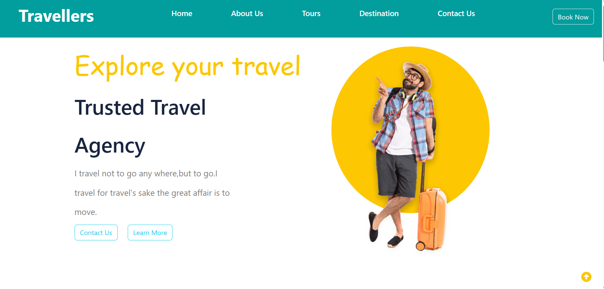

# Traveller

Welcome to the Traveler Website! This is a simple static website created using HTML, CSS and JS to provide travelers with information and inspiration for their next adventure. This README will guide you through the structure of the project, how to set it up locally, and make modifications if needed.



## Table of Contents
1. [Project Structure](#project-structure)
2. [Getting Started](#getting-started)
3. [Customization](#customization)
4. [Contributing](#contributing)
5. [License](#license)

---

## Project Structure

The project structure is organized as follows:

```
traveler-website/
│   index.html          # The main HTML file
└───   travel.css           # The main CSS file
└───   images/             # Directory for storing images
└───   travel.js

```

- `index.html`: This is the main HTML file that contains the structure and content of the website.
- `travel.css`: The main CSS file for styling the website.
- `images/`: A directory to store all the images used in the website.
- `travel.js`: If you decide to add interactivity to your website with JavaScript, you can place your JavaScript files here.

---

## Getting Started

To run this website locally, follow these steps:

1. **Clone the repository:**

    ```
    git clone https://github.com/shreyash776/traveller.git
    ```

2. **Navigate to the project directory:**

    ```
    cd traveler-website
    ```

3. **Open `index.html` in a web browser:**

    Simply double-click on `index.html`, and it will open in your default web browser. You can also right-click on the file and select "Open with" to choose a specific browser.

That's it! You should now see the Traveler Website locally on your computer.

---

## Customization

You can customize this website to your liking by making changes to the HTML and CSS files:

- **HTML (`index.html`):**
    - Modify the content, headings, and paragraphs to suit your needs.
    - Add or remove sections as necessary.
    - Update links and navigation to point to the desired destinations.

- **CSS (`travel.css`):**
    - Adjust the styles, colors, fonts, and layout to match your branding or personal preferences.
    - Customize the website's appearance to create a unique look and feel.

Feel free to explore and experiment with the code to make this website your own.

---

## Contributing

If you'd like to contribute to this project, please follow these steps:

1. Fork the repository to your GitHub account.
2. Create a new branch for your feature or bug fix: `git checkout -b feature-name`.
3. Make your changes and commit them: `git commit -m "Description of changes"`.
4. Push your changes to your fork: `git push origin feature-name`.
5. Open a pull request on the original repository, describing your changes in detail.

We welcome contributions from the community!

---

## License

This Traveler Website is open-source and available under the [MIT License](LICENSE). You are free to use, modify, and distribute the code as long as you include the original license text. See the [LICENSE](LICENSE) file for more details.

Happy traveling and website building! 🌍✈️🌴
```

Copy and paste this markup code into your README.md file in your project's repository. You can then make any necessary adjustments or additions based on your specific project details.